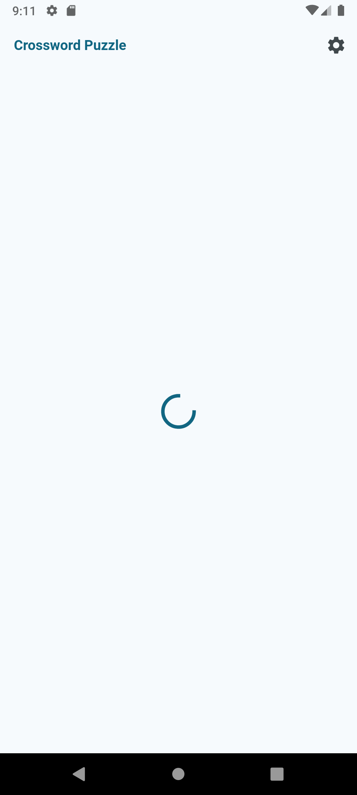

# word_puzzle 
I implemented a Google codelab, a crossword generator that became a puzzle game. 

## Key Concepts Learnt
- I learnt running background computations in a pool of isolates. 
- I got introducted to immutable data structures to ease the implementation of a backtracking algorithm.
- I also learned how to use the TableView widget.

### Supporting Platforms
- Android 
- iOS
- Web
- Linux 
- Windows
- MacOS

### Notes
- The full size content view effect on macOS was achieved by modifying the macos/Runner/Base.lproj/MainMenu.xib XML file by adding the attributes titlebarAppearsTransparent="YES" and titleVisibility="hidden" to the //document/objects/window XML node, and fullSizeContentView="YES" to the //document/objects/window/windowStyleMask XML node. If you would like to dive deeper into making your Flutter apps look at home on macOS, see the [macos_window_utils](https://pub.dev/packages/macos_window_utils) and [macos_ui](https://pub.dev/packages/macos_ui) Flutter packages.

- What is backtracking? According to Wikipedia, backtracking is a class of algorithms for finding solutions to some computational problems, notably constraint satisfaction problems, that incrementally builds candidates to the solutions and abandons a candidate, or backtracks, as soon as it determines that the candidate cannot possibly be completed to a valid solution. For more information, see [Backtracking](https://en.wikipedia.org/wiki/Backtracking).

-  Switch expressions and pattern matching over records to select the appropriate way to display different durations ranging from seconds to days. For more information about this style of code, see [the Dive into Dart's patterns and records](https://codelabs.developers.google.com/codelabs/dart-patterns-records) codelab.

[Check out the codelab here.](https://codelabs.developers.google.com/codelabs/flutter-word-puzzle)

 
 
 
 
 
 
 
 

